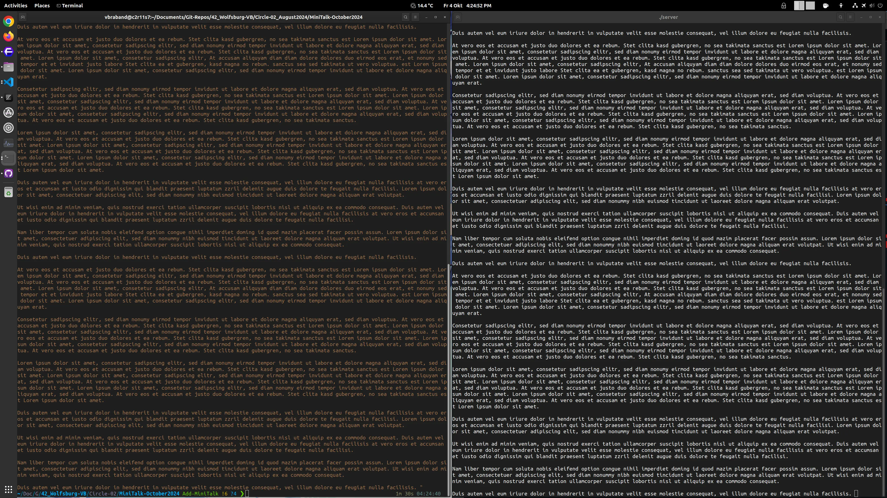
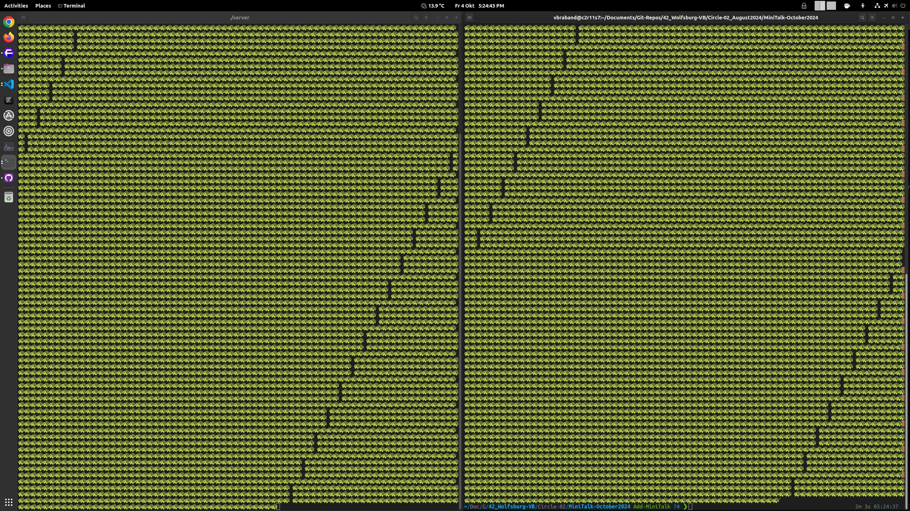

# MiniTalk

## A UNIX Signals-based messaging Server and Client



Our goal was to make a messaging server and client in C using the internal UNIX signal protocol.

> Signals are standardized messages sent to a running program to trigger specific behavior, such as quitting or error handling. They are a limited form of inter-process communication (IPC), typically used in Unix, Unix-like, and other POSIX-compliant operating systems.
>
> A signal is an asynchronous notification sent to a process or to a specific thread within the same process to notify it of an event. Common uses of signals are to interrupt, suspend, terminate or kill a process. Signals originated in 1970s Bell Labs Unix and were later specified in the POSIX standard.
> [- Signals - Wikipedia](https://en.wikipedia.org/wiki/Signal_(IPC))

**TLDR;** You know when you want to kill a process in the **System Monitor** (Task Manager) on linux, when you press to kill a process, the task manager sends a **"Signal"** to the process telling it to die, well we are basically recycling this Signal system to create an internal text massaging server and client written in C.

> This code technically works, but it is very sensitive to other system processes, I found my MiniTalk can manage up to 66,000 charecters (12,000 words) Lorum Ipsum when no other programs/processes are opened, so if you wondering why it's outputing garbage output when using a 2000+ words text, then yeah it's kinda a system issue (Kinda because I believe Signals aren't designed for these types of uses), this project was made when MacOS (Unix) was the standard at 42, but now with Ubuntu (Linux), the way these

## Features



- Unicode support

### Bonus (WIP - Incomplete)

- Server returns a signal as confirmation that signal has been recieved

## Usage

### Compiling

- Normal Compile:       `make`
- Bonus Compile:        `make bonus`
- Normal Re-Compile:    `make re`
- Bonus Re-Compile:     `make re_bonus`
- Normal Auto-Compile:  `make auto` (Compiles and then delete object files)
- Bonus Auto-Compile:   `make auto_bonus` (Same as Normal just bonus)

### Running

1. Run the `server` executable in a terminal, the server should print out a PID number.
2. In a seperate terminal run

```bash
   ./client <PID_NUM> "<Message>"
```

## Issues

Every MiniTalk project (including mine and literally one from a staff member) has a de-facto text length limit of around ~2000 words on Linux.

From what I heard fromW senior students, their code worked perfectly when they were using MacOS, I suspect it may be because differences on how MacOS (UNIX) and Ubuntu (Linux) deals with Signals.

So to break MiniTalk just give it 3000+ words (from the [**Lorum Ipsum**](https://www.loremipsum.de/) for example) and then see the wonderful cries of the PC terminal.

## Credits
