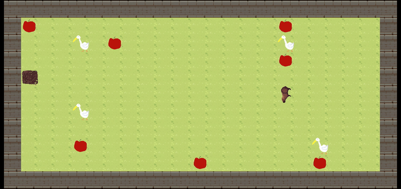

# Operation Capybara Freedom (So_Long)



A 2D capybara game utilising [MiniLibX](https://github.com/42Paris/minilibx-linux).

Worked with [Grumpyx3](https://github.com/Grumpyx3).

> Note: **`choose_map.sh`** is not required by the project, it's just a fancy extra script I wrote to make my life easier

## What we implemented

- Character turning depending on direction
- Enemies (They don't move but yeah they still kill you so still counts)
- Increased Tile size to 120
- Beautiful capybara assets and story

## Usage

### Dependencies

#### Linux

```bash
sudo apt-get update && sudo apt-get install xorg libxext-dev zlib1g-dev libbsd-dev
```

### Running

- Normal Compile: `make`
- Normal Run: `./so_long maps/[map]`
- Auto Run: `make auto` ((re)compiles and then redirects to `./choose_map.sh`)
- Valgrind Run: `make debug` ((re)compiles and then runs with Valgrind)

## Credits

### Coding

- [Grumpyx3](https://github.com/Grumpyx3) for helping
- [Acloos](https://gitlab.com/42_cursus1/so_long/) for honestly main inspiration for the code really
- [Pulgamecanica](https://github.com/pulgamecanica)'s amazing [blog/guide to MLX animations](https://pulgamecanica.herokuapp.com/posts/mlx-animations) (We ended up not going as extreme has he did, but was still a good read)
- [42Paris](https://github.com/42Paris) for actually writing the bloody [MiniLibX](https://github.com/42Paris/minilibx-linux)

### Assets

- Me for Pelican, Exit (Pool) and Editing
- [NiffirgGames](https://niffirggames.itch.io/) for [Charlie the Capybara](https://niffirggames.itch.io/charliethecapybara) textures
- [Cainos](https://cainos.itch.io/) for his godly amazing [Pixel-Art-Top-Down](https://cainos.itch.io/pixel-art-top-down-basic) textures (which I took the walls from)
- [Cup Nooble](https://cupnooble.itch.io/) for there very nice pastel [Sprout-lands asset pack](https://cupnooble.itch.io/sprout-lands-asset-pack) (which I took the grass from)

### Tools used

- [VScode](https://code.visualstudio.com/) - IDE
- [GIMP](https://www.gimp.org/) - Photo-editor
- [Krita](https://krita.org/en/) - Some drawings
- [Libresprite](https://libresprite.github.io/#!/) (FOSS fork of Aesprite) - Pixel-art drawings
