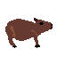
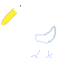

# Original Assets

## Apple

Was drawn using Libresprite as a replacement for the then placeholder Minecraft apple.

## Capybara

Was also drawn in Libresprite just for fun but was later replaced by Charlie the Capybara because my capybara image was too small, but maybe I will change it back.

## Pelican

Was also drawn using Libresprite, people thinks it looks like a goose but I think it's perfect.
